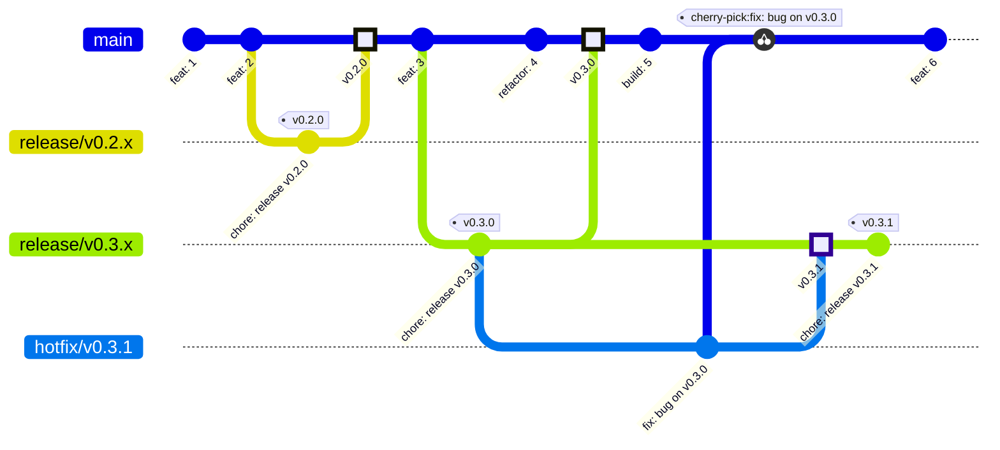
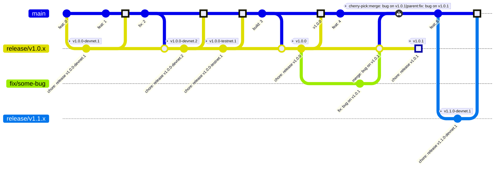

# Release Process and Versioning Strategy

## Overview

This guide outlines the release and versioning strategy for the `nexus` and `nexus-sdk` projects. It ensures consistency, clarity, and synchronization between both projects throughout their lifecycle, adhering strictly to Semantic Versioning (semver).

## Branch and Tag Naming Conventions

### Branches

- **Development Branch:** `main` (always latest development state)
- **Release Branches:** `release/v{major}.{minor}.x` (e.g., `release/v0.2.x`)
  - ⚠️ Those branches should have the same protection rules as `main`

### Tags

#### Before Tesnet

- **Final release only:** `v0.{minor}.{patch}` (e.g., `v0.2.0`)

#### Before Mainnet (`< v1.0.0`)

- **Devnet tags:** `v0.{minor}.{patch}-devnet.{n}` (e.g., `v0.2.0-devnet.1`)
- **Testnet tags (final release):** `v0.{minor}.{patch}` (e.g., `v0.2.0`)

#### After Mainnet (`>= v1.0.0`)

- **Devnet tags:** `v{major}.{minor}.{patch}-devnet.{n}` (e.g., `v1.0.0-devnet.1`)
- **Testnet tags:** `v{major}.{minor}.{patch}-testnet.{n}` (e.g., `v1.0.0-testnet.1`)
- **Mainnet tags (final release):** `v{major}.{minor}.{patch}` (e.g., `v1.0.0`)

## Pull Request Guidelines for New Releases

- Create a new `release/v*` branch.
- Create a release PR targeting the respective `release/v*` branch.
- The release PR titles must follow the [Conventional Commits][conventional-commits] specification: `chore: release v{major}.{minor}.{patch}(-{suffix})`.
- In the PR, bump the crates versions for the release.
- Review the `CHANGELOG` updating the version from `Unreleased` accordingly, including the release date, and make sure that breaking changes, new features, and bug fixes are clearly documented.
- After **squash merging** the PR to the `release/v*` branch, tag the last commit in the `release/v*` branch with the expected tag.

## Git Flow

> [!IMPORTANT]
> Since we need to update the `version` field in the `Cargo.toml` file for every release, **a commit hash cannot have more than 1 tag associated to it**. For example, if we want to promote a deployment from `devnet` to `testnet` without any source code changes (new features, bug fixes, etc), we should still create a new release PR just to update the `version` in the `Cargo.toml` file.

Also:

> [!NOTE]
> All highlighted merge commits will trigger a deployment to the respective environment for that tag.

### Before Mainnet (`< v1.0.0`)

### After Mainnet (`>= v1.0.0`)

## Deployments

> [!INFO]
> All commits merged into `main` should build a docker image with the current *commit hash* as the *image tag*. This allows the deployment of custom builds into separate environments for testing.

### Before `v1.0.0`

- All tags are deployed to `devnet` .
- Tags selected by the engineering team are deployed to `testnet`.

### After `v1.0.0`

- All `devnet` tags are deployed to `devnet`.
- All `testnet` tags are deployed to `testnet` and `devnet`.
- All final versions are deployed to `mainnet`, `testnet` and `devnet`.

## Version Synchronization Between Nexus and Nexus-SDK

- Both repositories (`nexus` and `nexus-sdk`) generally share the same semantic `v{major}.{minor}` version numbers.
- Ensure corresponding branches and tags exist simultaneously on both repositories.
- For every release, maintain consistency for the `{major}.{minor}` version.

Keeping the same version on both projects will avoid the necessity of creating a version matrix and compatibility table.

### Version bump strategy

Since `nexus` has a direct dependency on `nexus-sdk` crates, we should follow this strategy to manage the downstream dependencies:

- All `nexus-sdk` crates should be bumped first, followed by the tagged release.
- Then, `nexus` is updated with the latest `nexus-sdk` version and released if there was a bump in at least a minor version in either package.

### Example scenarios

**Example 1:** If `nexus` has a hotfix, increment only the `nexus` patch (e.g., `nexus` becomes `v1.0.1`, while `nexus-sdk` remains at `v1.0.0`).

**Example 2:** If `nexus-sdk` introduces new features independently, but `nexus` doesn't, increment only the patch on `nexus-sdk`.

## Documentation Maintenance and Support Strategy

### Before Mainnet

- Only maintain and update documentation for the latest version deployed to `testnet`.

### After Mainnet

- Maintain two versions of documentation:
  - `v{major}`: Production documentation aligned with the current stable release.
  - `main`: Documentation reflecting upcoming features and experimental releases.

## Patching existing versions

- Any patches to released versions are created from their respective `release/v{major}.{minor}.x` branch.
- After fixing critical issues:
  - Merge the hotfix branch back into its corresponding `release/*` branch.
  - Tag the resulting commit in the `release/*` branch as `v{major}.{minor}.{patch}`.
  - Cherry-pick the fix commit(s) to the `main` branch.
  - Deploy immediately to all environments connected to the version (`devnet`, `testnet`, and/or `mainnet`).

[conventional-commits]: https://www.conventionalcommits.org/
