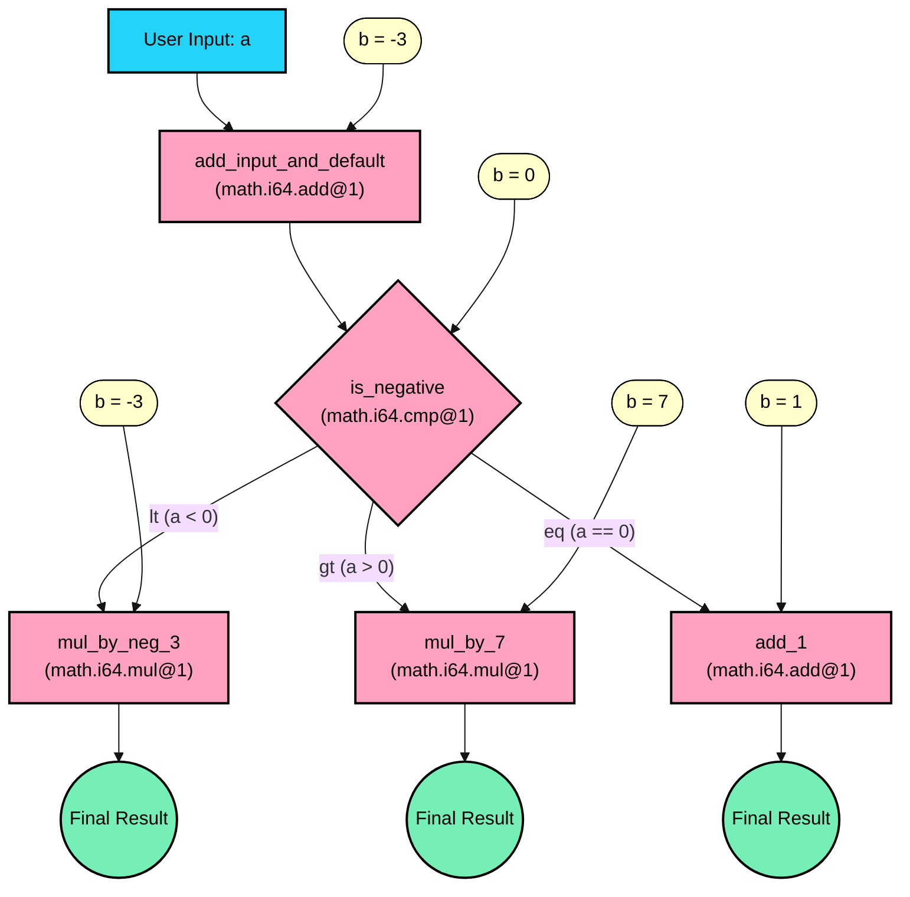

# Build the Quickstart

This guide walks through the process of constructing a Directed Acyclic Graph (DAG) that demonstrates conditional logic using standard Nexus math tools. We will build the [`math_branching.json`](https://github.com/Talus-Network/nexus-sdk/blob/v0.1.0/cli/src/dag/_dags/math_branching.json) DAG that was used in the [quickstart example](math-branching-quickstart.md) step-by-step, applying the concepts outlined in the main [Nexus DAG Construction Guide](dag-construction.md).

 Prerequisites
Follow the [setup guide](setup.md) to get properly setup in case you haven't.


The goal is to build a DAG that:

1. Takes a single number `a` as input.
2. Adds `-3` to `a`.
3. Compares the result to `0`.
4. Based on the comparison:
   - If the result is less than 0, multiply it by `-3`.
   - If the result is greater than 0, multiply it by `7`.
   - If the result is equal to 0, add `1`.
5. Outputs the final calculated number.

## DAG Overview

Before diving into the JSON, let's visualize the workflow using a Mermaid diagram:



This diagram shows the flow of data, starting from the user input, through the addition and comparison steps, branching based on the comparison result, and finally reaching one of the possible calculation end-points. The constant default values are shown directly connected to each step that requires them.

## Core DAG Components Recap

As detailed in the [DAG Construction Guide](dag-construction.md), Nexus DAGs are defined in JSON and primarily consist of:

- `vertices`: Define all processing steps (Tools) within the DAG.
- `edges`: Define the data flow connections between vertices, linking output ports (or better yet, output variants) to input ports.
- `default_values`: Provide static or pre-configured inputs to vertices.
- `entry_groups` (Optional): Define named starting configurations. If omitted, entry points are determined implicitly.

## Understanding the Math Tools

This DAG uses tools from the `xyz.taluslabs.math.i64` namespace. Based on the standard Rust tool interface described in the [Nexus Toolkit for Rust documentation](../toolkit-rust.md), we can infer the following about the tools used:

- `xyz.taluslabs.math.i64.add@1`:
  - Input: Takes two `i64` numbers, typically named `a` and `b`.
  - Output: If successful (`ok` variant), outputs an `i64` named `result`.
- `xyz.taluslabs.math.i64.mul@1`:
  - Input: Takes two `i64` numbers, typically named `a` and `b`.
  - Output: If successful (`ok` variant), outputs an `i64` named `result`.
- `xyz.taluslabs.math.i64.cmp@1`:
  - Input: Takes two `i64` numbers, typically named `a` and `b`.
  - Output: Based on comparing `a` to `b`, it outputs the value of `a` and `b` under one of three variants: `lt` (less than), `gt` (greater than), or `eq` (equal to).

## Step-by-Step Construction

Let's build the `math_branching.json` file section by section.

### 1. Define Vertices (`vertices` list)

First, we define all the nodes (steps) in our graph. Each vertex needs a unique `name` and specifies the `tool_fqn` it will execute.

```json
{
  // ... other sections ...
  "vertices": [
    {
      // Initial addition step
      "kind": {
        "variant": "off_chain",
        "tool_fqn": "xyz.taluslabs.math.i64.add@1"
      },
      "name": "add_input_and_default",
      // Declares 'a' as an input port that needs to be provided.
      // 'b' will be provided by a default value.
      "entry_ports": [
        {
          "name": "a",
          "encrypted": false
        }
      ]
    },
    {
      // Comparison step
      "kind": {
        "variant": "off_chain",
        "tool_fqn": "xyz.taluslabs.math.i64.cmp@1"
      },
      "name": "is_negative"
      // Input ports 'a' and 'b' will be provided by an edge and a default value,
      // so they don't need to be listed here.
    },
    {
      // Multiplication step for the 'less than' branch
      "kind": {
        "variant": "off_chain",
        "tool_fqn": "xyz.taluslabs.math.i64.mul@1"
      },
      "name": "mul_by_neg_3"
      // Input ports 'a' and 'b' will be provided by an edge and a default value.
    },
    {
      // Multiplication step for the 'greater than' branch
      "kind": {
        "variant": "off_chain",
        "tool_fqn": "xyz.taluslabs.math.i64.mul@1"
      },
      "name": "mul_by_7"
      // Input ports 'a' and 'b' will be provided by an edge and a default value.
    },
    {
      // Addition step for the 'equal to' branch
      "kind": {
        "variant": "off_chain",
        "tool_fqn": "xyz.taluslabs.math.i64.add@1"
      },
      "name": "add_1"
      // Input ports 'a' and 'b' will be provided by an edge and a default value.
    }
  ]
  // ... other sections ...
}
```

- We define five vertices, each corresponding to a step in our desired workflow.
- `add_input_and_default` explicitly lists `a` in `entry_ports`. This signifies that if `a` isn't provided by an incoming edge or a default value, it must be provided externally when the DAG starts (making it an entry port in the default entry scenario).

### 2. Define Edges (`edges` list)

Next, we connect the vertices to define the data flow and branching logic.

```json
{
  // ... other sections ...
  "edges": [
    {
      // Connect the result of the initial addition to the comparison step
      "from": {
        "vertex": "add_input_and_default", // Source vertex name
        "output_variant": "ok", // Use the successful output
        "output_port": "result" // The name of the output port from add@1
      },
      "to": {
        "vertex": "is_negative", // Target vertex name
        "input_port": "a" // Connect to the 'a' input port of cmp@1
      }
    },
    {
      // Branch: If comparison is 'less than' (lt)
      "from": {
        "vertex": "is_negative", // Source: the comparison vertex
        "output_variant": "lt", // Use the 'less than' output variant
        "output_port": "a" // The output port from cmp@1 (contains the original 'a' value)
      },
      "to": {
        "vertex": "mul_by_neg_3", // Target: the multiply-by--3 vertex
        "input_port": "a" // Connect to its 'a' input port
      }
    },
    {
      // Branch: If comparison is 'greater than' (gt)
      "from": {
        "vertex": "is_negative",
        "output_variant": "gt", // Use the 'greater than' output variant
        "output_port": "a"
      },
      "to": {
        "vertex": "mul_by_7", // Target: the multiply-by-7 vertex
        "input_port": "a"
      }
    },
    {
      // Branch: If comparison is 'equal' (eq)
      "from": {
        "vertex": "is_negative",
        "output_variant": "eq", // Use the 'equal' output variant
        "output_port": "a"
      },
      "to": {
        "vertex": "add_1", // Target: the add-1 vertex
        "input_port": "a"
      }
    }
  ]
  // ... other sections ...
}
```

- The first edge connects the `result` of `add_input_and_default` to the `a` input of `is_negative`.
- The next three edges implement the branching logic. They all originate from `is_negative` but use different `output_variant`s (`lt`, `gt`, `eq`) corresponding to the comparison result. Each connects the `a` output of the comparison (which holds the number being compared) to the `a` input of the appropriate downstream math operation.

### 3. Set Default Values (`default_values` list)

We provide the constant values needed for the operations.

```json
{
  "default_values": [
    {
      // Provide the second operand for the initial addition
      "vertex": "add_input_and_default",
      "input_port": "b",
      "value": { "storage": "inline", "data": -3 }
    },
    {
      // Provide the value to compare against (0) for the 'is_negative' step
      "vertex": "is_negative",
      "input_port": "b",
      "value": { "storage": "inline", "data": 0 }
    },
    {
      // Provide the multiplier (-3) for the 'lt' branch
      "vertex": "mul_by_neg_3",
      "input_port": "b",
      "value": { "storage": "inline", "data": -3 }
    },
    {
      // Provide the multiplier (7) for the 'gt' branch
      "vertex": "mul_by_7",
      "input_port": "b",
      "value": { "storage": "inline", "data": 7 }
    },
    {
      // Provide the addend (1) for the 'eq' branch
      "vertex": "add_1",
      "input_port": "b",
      "value": { "storage": "inline", "data": 1 }
    }
  ]
  // ... other sections ...
}
```

- Each entry specifies the `vertex` and `input_port` to receive the value.
- `"storage": "inline"` means the `data` is directly embedded in the DAG definition.

### 4. Specify outputs (`outputs` list)

In order to access the final result of the DAG, we need to define outputs for the vertices that do not have outgoing edges. In this case, all our math operations have an output port named `result`, so we can define them as follows:

```json
{
  // ... other sections ...
  "outputs": [
    {
      "vertex": "mul_by_neg_3",
      "output_variant": "ok",
      "output_port": "result"
    },
    {
      "vertex": "mul_by_7",
      "output_variant": "ok",
      "output_port": "result"
    },
    {
      "vertex": "add_1",
      "output_variant": "ok",
      "output_port": "result"
    }
  ]
}
```

### 5. Entry Points (Implicit Default)

Since we haven't defined an `entry_groups` section, Nexus uses the default entry mechanism, i.e. `_default_group`. It identifies vertices that have entry ports specified.

In our case:

- `add_input_and_default` has entry port `a`.
- `a` is not the target of any `edge`.
- `a` does not have a _default value_.
- Therefore, `add_input_and_default` becomes the sole entry point, and its `a` port becomes the _entry port_. The user must provide a value for `a` when executing the DAG.

## Putting It All Together

Combining these sections gives us the complete `math_branching.json`:

<details>
<summary>Complete DAG Definition</summary>

```json
// math_branching.json
{
  "default_values": [
    {
      "vertex": "add_input_and_default",
      "input_port": "b",
      "value": {
        "storage": "inline",
        "data": -3
      }
    },
    {
      "vertex": "mul_by_neg_3",
      "input_port": "b",
      "value": {
        "storage": "inline",
        "data": -3
      }
    },
    {
      "vertex": "mul_by_7",
      "input_port": "b",
      "value": {
        "storage": "inline",
        "data": 7
      }
    },
    {
      "vertex": "is_negative",
      "input_port": "b",
      "value": {
        "storage": "inline",
        "data": 0
      }
    },
    {
      "vertex": "add_1",
      "input_port": "b",
      "value": {
        "storage": "inline",
        "data": 1
      }
    }
  ],
  "vertices": [
    {
      "kind": {
        "variant": "off_chain",
        "tool_fqn": "xyz.taluslabs.math.i64.add@1"
      },
      "name": "add_input_and_default",
      "entry_ports": [
        {
          "name": "a",
          "encrypted": false
        }
      ]
    },
    {
      "kind": {
        "variant": "off_chain",
        "tool_fqn": "xyz.taluslabs.math.i64.cmp@1"
      },
      "name": "is_negative"
    },
    {
      "kind": {
        "variant": "off_chain",
        "tool_fqn": "xyz.taluslabs.math.i64.mul@1"
      },
      "name": "mul_by_neg_3"
    },
    {
      "kind": {
        "variant": "off_chain",
        "tool_fqn": "xyz.taluslabs.math.i64.mul@1"
      },
      "name": "mul_by_7"
    },
    {
      "kind": {
        "variant": "off_chain",
        "tool_fqn": "xyz.taluslabs.math.i64.add@1"
      },
      "name": "add_1"
    }
  ],
  "edges": [
    {
      "from": {
        "vertex": "add_input_and_default",
        "output_variant": "ok",
        "output_port": "result"
      },
      "to": {
        "vertex": "is_negative",
        "input_port": "a"
      }
    },
    {
      "from": {
        "vertex": "is_negative",
        "output_variant": "lt",
        "output_port": "a"
      },
      "to": {
        "vertex": "mul_by_neg_3",
        "input_port": "a"
      }
    },
    {
      "from": {
        "vertex": "is_negative",
        "output_variant": "gt",
        "output_port": "a"
      },
      "to": {
        "vertex": "mul_by_7",
        "input_port": "a"
      }
    },
    {
      "from": {
        "vertex": "is_negative",
        "output_variant": "eq",
        "output_port": "a"
      },
      "to": {
        "vertex": "add_1",
        "input_port": "a"
      }
    }
  ],
  "outputs": [
    {
      "vertex": "mul_by_neg_3",
      "output_variant": "ok",
      "output_port": "result"
    },
    {
      "vertex": "mul_by_7",
      "output_variant": "ok",
      "output_port": "result"
    },
    {
      "vertex": "add_1",
      "output_variant": "ok",
      "output_port": "result"
    }
  ]
  // No "entry_groups" section needed, default mechanism applies.
}
```

</details>

## Validation and Execution with the CLI

Now that you've constructed the branching math DAG, you can test it out with the Nexus CLI. For detailed steps on how to validate, publish, and execute this DAG with different inputs, see the [Dev Quickstart](math-branching-quickstart.md) guide.

The quickstart provides step-by-step instructions for:

- Validating the DAG structure
- Publishing the DAG to make it executable
- Executing the DAG with different input values to test all three branches
- Understanding the results of each execution path

## Summary

This guide demonstrated how to construct a Nexus DAG (`math_branching.json`) involving conditional logic:

- Defined multiple vertices using standard math tools.
- Used edges with specific `output_variant`s (`lt`, `gt`, `eq`) from the comparison tool (`cmp@1`) to create branching paths.
- Utilized `default_values` to provide constant operands for the math operations.
- Relied on the default entry mechanism to define the DAG's starting point and required input.

This example showcases how to combine simple tools and DAG structure definitions to create workflows with non-linear, conditional execution paths. Refer to the [DAG Construction Guide](dag-construction.md) for more advanced features and rules.

## Up Next

Want to extend this example? Follow the next part of the guide to see how we can add another entry point to the DAG and manage this through entry groups.
