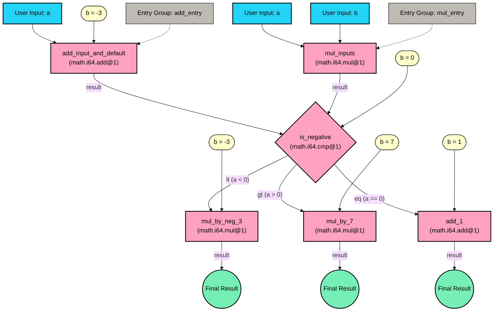

# Extending Your DAG with Entry Groups

This guide builds on the [Build the Quickstart guide][math-branching-dag-builder-guide] by extending the example to support multiple entry points using entry groups. You'll take the original [`math_branching.json`](https://github.com/Talus-Network/nexus-sdk/blob/v0.1.0/cli/src/dag/_dags/math_branching.json) DAG and add an alternative entry path that allows users to directly provide two numbers for multiplication instead of adding a constant to the input.

 Prerequisites
Follow the [setup guide](setup.md) to get properly setup in case you haven't.


## What You'll Learn

- How to add multiple entry points to a DAG
- How to define and use entry groups
- How to ensure DAG validity with multiple entry paths
- How different entry groups affect execution flow

## Understanding Entry Groups

Entry groups define named sets of entry points for a DAG. They allow you to:

- Provide multiple ways to start a DAG execution
- Group related entry vertices
- Explicitly specify which vertices should be considered entry points


Without entry groups, a DAG uses the default entry mechanism (vertices with unsatisfied input ports become entry points). With entry groups, you gain explicit control over how the DAG can be started.


### Why Use Entry Groups?

The explanation above should allow you to understand why, given a certain DAG definition, you might want to have explicit control over how the DAG execution can start. However, you might be thinking: _Why design the DAG like this in the first place? Could you not simply split this up into independent DAGs?_ The answer is yes, yes you could. Whether you choose to split up different entry configurations into separate DAGs or define a composite DAG with flexibility through entry groups, will be a design choice depending on your specific preferences and use case. Nexus is agnostic to these design choices and provides you the ability to do both!

## The Extended DAG

We'll extend our original branching math DAG by:

1. Adding a new vertex `mul_inputs` that takes two user-provided inputs and multiplies them
2. Connecting this multiplication result to the same comparison step as the original addition result
3. Creating two explicit entry groups to select between the addition path and the multiplication path

Here's a visual representation of the extended workflow:



This diagram shows the extended workflow with two entry paths:

1. The original addition path that takes one input and adds `-3` to it
2. A new multiplication path that takes two inputs and multiplies them

Both paths connect to the same comparison vertex, which then branches based on whether the result is negative, positive, or zero. Entry groups ensure only one path is active during execution.

## Step-by-Step Construction

Let's build the `math_branching_entry_group.json` file step by step.

### 1. Define Vertices (`vertices` list)

We'll start with the vertices from our original DAG and add the new `mul_inputs` vertex:

```json
{
  "vertices": [
    {
      "kind": {
        "variant": "off_chain",
        "tool_fqn": "xyz.taluslabs.math.i64.add@1"
      },
      "name": "add_input_and_default",
      "entry_ports": ["a"]
    },
    {
      "kind": {
        "variant": "off_chain",
        "tool_fqn": "xyz.taluslabs.math.i64.mul@1"
      },
      "name": "mul_inputs",
      "entry_ports": ["a", "b"]
    },
    {
      "kind": {
        "variant": "off_chain",
        "tool_fqn": "xyz.taluslabs.math.i64.cmp@1"
      },
      "name": "is_negative"
    },
    {
      "kind": {
        "variant": "off_chain",
        "tool_fqn": "xyz.taluslabs.math.i64.mul@1"
      },
      "name": "mul_by_neg_3"
    },
    {
      "kind": {
        "variant": "off_chain",
        "tool_fqn": "xyz.taluslabs.math.i64.mul@1"
      },
      "name": "mul_by_7"
    },
    {
      "kind": {
        "variant": "off_chain",
        "tool_fqn": "xyz.taluslabs.math.i64.add@1"
      },
      "name": "add_1"
    }
  ]
}
```

Note that we explicitly list both `a` and `b` as `entry_ports` for the `mul_inputs` vertex because both will be provided by the user, not by default values or edges.

### 2. Define Edges (`edges` list)

Now we'll define the edges, including a new edge from our new `mul_inputs` vertex to the comparison step:

```json
{
  "edges": [
    {
      "from": {
        "vertex": "add_input_and_default",
        "output_variant": "ok",
        "output_port": "result"
      },
      "to": {
        "vertex": "is_negative",
        "input_port": "a"
      }
    },
    {
      "from": {
        "vertex": "mul_inputs",
        "output_variant": "ok",
        "output_port": "result"
      },
      "to": {
        "vertex": "is_negative",
        "input_port": "a"
      }
    },
    {
      "from": {
        "vertex": "is_negative",
        "output_variant": "lt",
        "output_port": "a"
      },
      "to": {
        "vertex": "mul_by_neg_3",
        "input_port": "a"
      }
    },
    {
      "from": {
        "vertex": "is_negative",
        "output_variant": "gt",
        "output_port": "a"
      },
      "to": {
        "vertex": "mul_by_7",
        "input_port": "a"
      }
    },
    {
      "from": {
        "vertex": "is_negative",
        "output_variant": "eq",
        "output_port": "a"
      },
      "to": {
        "vertex": "add_1",
        "input_port": "a"
      }
    }
  ]
}
```

The key addition is the second edge, which connects the output of our new `mul_inputs` vertex to the same input port of the `is_negative` vertex that `add_input_and_default` connects to.

### 3. Set Default Values (`default_values` list)

We'll keep the same default values as the original DAG:

```json
{
  "default_values": [
    {
      "vertex": "add_input_and_default",
      "input_port": "b",
      "value": {
        "storage": "inline",
        "data": -3
      }
    },
    {
      "vertex": "is_negative",
      "input_port": "b",
      "value": {
        "storage": "inline",
        "data": 0
      }
    },
    {
      "vertex": "mul_by_neg_3",
      "input_port": "b",
      "value": {
        "storage": "inline",
        "data": -3
      }
    },
    {
      "vertex": "mul_by_7",
      "input_port": "b",
      "value": {
        "storage": "inline",
        "data": 7
      }
    },
    {
      "vertex": "add_1",
      "input_port": "b",
      "value": {
        "storage": "inline",
        "data": 1
      }
    }
  ]
}
```

### 4. Specify outputs (`outputs` list)

Outputs will also remain identical.

```json
{
  // ... other sections ...
  "outputs": [
    {
      "vertex": "mul_by_neg_3",
      "output_variant": "ok",
      "output_port": "result"
    },
    {
      "vertex": "mul_by_7",
      "output_variant": "ok",
      "output_port": "result"
    },
    {
      "vertex": "add_1",
      "output_variant": "ok",
      "output_port": "result"
    }
  ]
}
```

Notice that we do not add any default values for the `mul_inputs` vertex, as both its input ports will be provided by the user.

### 4. Define Entry Groups (`entry_groups` list)

This is where the major addition happens. We'll define two entry groups:

```json
{
  "entry_groups": [
    {
      "name": "add_entry",
      "vertices": ["add_input_and_default"]
    },
    {
      "name": "mul_entry",
      "vertices": ["mul_inputs"]
    }
  ]
}
```

Each entry group has a name and a list of vertices When executing the DAG, you'll specify which entry group to use, and the DAG will expect inputs for _entry ports_ defined on the specified vertices.

### 5. Why Entry Groups Are Required

Without entry groups, the DAG would have an issue: both `add_input_and_default` and `mul_inputs` would be considered entry vertices, but both connect to the same input port of `is_negative`. This creates a potential race condition (violating Rule 5 of the [Workflow](../../nexus-next/packages/workflow.md)). With entry groups, we explicitly specify which entry paths are valid and ensure they won't be active simultaneously.

## Putting It All Together

Combining these sections gives us the complete `math_branching_entry_group.json`:

<details>
<summary>Complete DAG Definition</summary>

```json
// math_branching_entry_group.json
{
  "vertices": [
    {
      "kind": {
        "variant": "off_chain",
        "tool_fqn": "xyz.taluslabs.math.i64.add@1"
      },
      "name": "add_input_and_default",
      "entry_ports": ["a"]
    },
    {
      "kind": {
        "variant": "off_chain",
        "tool_fqn": "xyz.taluslabs.math.i64.mul@1"
      },
      "name": "mul_inputs",
      "entry_ports": ["a", "b"]
    },
    {
      "kind": {
        "variant": "off_chain",
        "tool_fqn": "xyz.taluslabs.math.i64.cmp@1"
      },
      "name": "is_negative"
    },
    {
      "kind": {
        "variant": "off_chain",
        "tool_fqn": "xyz.taluslabs.math.i64.mul@1"
      },
      "name": "mul_by_neg_3"
    },
    {
      "kind": {
        "variant": "off_chain",
        "tool_fqn": "xyz.taluslabs.math.i64.mul@1"
      },
      "name": "mul_by_7"
    },
    {
      "kind": {
        "variant": "off_chain",
        "tool_fqn": "xyz.taluslabs.math.i64.add@1"
      },
      "name": "add_1"
    }
  ],
  "edges": [
    {
      "from": {
        "vertex": "add_input_and_default",
        "output_variant": "ok",
        "output_port": "result"
      },
      "to": {
        "vertex": "is_negative",
        "input_port": "a"
      }
    },
    {
      "from": {
        "vertex": "mul_inputs",
        "output_variant": "ok",
        "output_port": "result"
      },
      "to": {
        "vertex": "is_negative",
        "input_port": "a"
      }
    },
    {
      "from": {
        "vertex": "is_negative",
        "output_variant": "lt",
        "output_port": "a"
      },
      "to": {
        "vertex": "mul_by_neg_3",
        "input_port": "a"
      }
    },
    {
      "from": {
        "vertex": "is_negative",
        "output_variant": "gt",
        "output_port": "a"
      },
      "to": {
        "vertex": "mul_by_7",
        "input_port": "a"
      }
    },
    {
      "from": {
        "vertex": "is_negative",
        "output_variant": "eq",
        "output_port": "a"
      },
      "to": {
        "vertex": "add_1",
        "input_port": "a"
      }
    }
  ],
  "default_values": [
    {
      "vertex": "add_input_and_default",
      "input_port": "b",
      "value": {
        "storage": "inline",
        "data": -3
      }
    },
    {
      "vertex": "is_negative",
      "input_port": "b",
      "value": {
        "storage": "inline",
        "data": 0
      }
    },
    {
      "vertex": "mul_by_neg_3",
      "input_port": "b",
      "value": {
        "storage": "inline",
        "data": -3
      }
    },
    {
      "vertex": "mul_by_7",
      "input_port": "b",
      "value": {
        "storage": "inline",
        "data": 7
      }
    },
    {
      "vertex": "add_1",
      "input_port": "b",
      "value": {
        "storage": "inline",
        "data": 1
      }
    }
  ],
  "entry_groups": [
    {
      "name": "add_entry",
      "vertices": ["add_input_and_default"]
    },
    {
      "name": "mul_entry",
      "vertices": ["mul_inputs"]
    }
  ],
  "outputs": [
    {
      "vertex": "mul_by_neg_3",
      "output_variant": "ok",
      "output_port": "result"
    },
    {
      "vertex": "mul_by_7",
      "output_variant": "ok",
      "output_port": "result"
    },
    {
      "vertex": "add_1",
      "output_variant": "ok",
      "output_port": "result"
    }
  ]
}
```

</details>

## Validation and Execution

### Validating the DAG

Use the `nexus dag validate` command to validate the DAG structure:

```bash
nexus dag validate --path cli/src/dag/_dags/math_branching_entry_group.json
```

This ensures your DAG conforms to all the rules, including those related to entry groups and potential race conditions.

### Publishing the DAG

After validation, publish the DAG:

```bash
# Publish the DAG
nexus dag publish --path cli/src/dag/_dags/math_branching_entry_group.json
# Example output: Published DAG with Object ID: <dag_object_id>
```

### Executing the DAG with Different Entry Groups

The key difference when executing this DAG is that you must specify which entry group to use:

#### Using the Addition Entry Group:

```bash
# Execute using the 'add_entry' group with a=10
nexus dag execute --dag-id <dag_object_id> --entry-group add_entry --input-json '{"add_input_and_default": {"a": 10}}' --inspect

# Example flow: (10 + -3) = 7. 7 > 0 (gt). 7 * 7 = 49.
```

#### Using the Multiplication Entry Group:

```bash
# Execute using the 'mul_entry' group with a=5, b=2
nexus dag execute --dag-id <dag_object_id> --entry-group mul_entry --input-json '{"mul_inputs": {"a": 5, "b": 2}}' --inspect

# Example flow: (5 * 2) = 10. 10 > 0 (gt). 10 * 7 = 70.
```

Note that with the `mul_entry` group, you must provide values for both input ports `a` and `b` of the `mul_inputs` vertex.

## The Power of Entry Groups

This example demonstrates several key advantages of entry groups:

1. **Multiple Entry Points**: The DAG now supports two different ways to start execution.
2. **Explicit Control**: Each entry group clearly defines which values need to be provided.
3. **Conflict Prevention**: Without entry groups, having both paths active could cause a race condition at the `is_negative.a` input port.
4. **Runtime Selection**: Users can choose which entry point to use when executing the DAG.

## Summary

In this guide, we extended our original branching math DAG to support multiple entry points using entry groups. We:

1. Added a new vertex that provides an alternative way to generate a value for comparison
2. Connected this vertex to the same downstream processing flow
3. Created explicit entry groups to control which entry path is active
4. Demonstrated how to execute the DAG with different entry groups

Entry groups are a powerful feature of Nexus DAGs that enable more flexible and modular workflows while maintaining the safety guarantees of the DAG execution model. They allow a single DAG to support multiple different starting states and input combinations while preventing potential race conditions.

For more advanced usage of entry groups and other DAG features, refer to the [DAG Construction Guide][dag-construction].

<!-- List of references -->

[dag-construction]: ./dag-construction.md
[math-branching-dag-builder-guide]: ./math-branching-dag-builder.md
