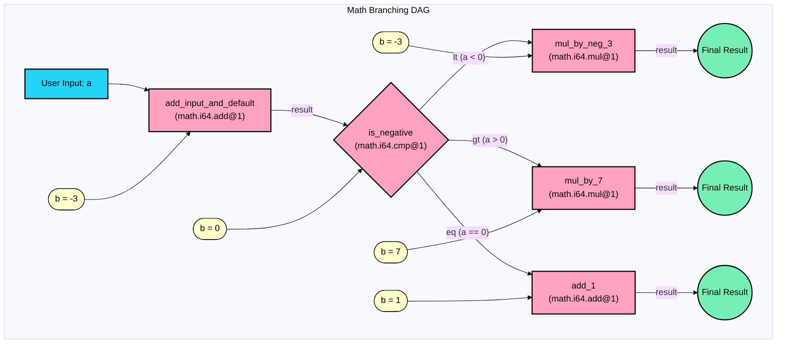

# Execute Your First Workflow in under 5 Minutes

This quickstart guide helps developers test the Nexus CLI with a simple end-to-end example in under 5 minutes. You'll validate, publish, and execute a branching math DAG that showcases Nexus's conditional logic capabilities without needing to understand all the details of DAG construction.

## What You'll Build


In the quickstart example we'll use a simple conceptual workflow consisting of standard Nexus math tools. This example is not really useful in the real world, but will allow to showcase the Nexus concepts and Nexus CLI usage that you'll be using for all of your real world use cases.


The [`math_branching.json` DAG][math-branching-dag] takes a number input, adds `-3` to it, checks if the result is negative, zero, or positive, and then performs one of three operations:
- If negative: Multiply by `-3`
- If positive: Multiply by `7`
- If zero: Add `1`

Here's a visual representation of the workflow:



## Prerequisites

- [Nexus CLI](../../CLI.md) installed
<!-- TODO: Add a link to CLI installation docs -->
- A configured Sui wallet for the publish step (can skip this step if just validating). Follow the [Getting Started section in the Sui Docs](https://docs.sui.io/guides/developer/getting-started) to get you set up.


In this example we will publish a DAG consisting of Nexus Tools that are running somewhere and registered (the URL can be found as metadata in the tool registry). If you were running your own tools and needed to register them, check out [Nexus CLI tool commands][nexus-cli-tool] to find out how to do this.


To check the tools that are registered in the tool registry, run:
```bash
nexus tool list
```

This should show the following tools running:

- xyz.taluslabs.math.i64.add@1
- xyz.taluslabs.math.i64.cmp@1
- xyz.taluslabs.math.i64.mul@1
- ...

## 1. Validate the DAG

First, validate the DAG structure using the Nexus CLI:

```bash
nexus dag validate --path cli/src/dag/_dags/math_branching.json
```

This step ensures the DAG structure meets all Nexus workflow rules before attempting to publish it.

## 2. Publish the DAG

Once validated, publish the DAG to make it executable:

```bash
# Publish the DAG (note the returned DAG Object ID)
nexus dag publish --path cli/src/dag/_dags/math_branching.json
# Example output: Published DAG with Object ID: <dag_object_id>
```

Take note of the DAG ID returned by this command - you'll need it in the next step.

## 3. Execute the DAG with Different Inputs

To execute the published DAG, use its ID and provide input for the entry vertex:

**Input JSON Structure:**
```json
// Example Input: provide value 10 to port 'a' of 'add_input_and_default'
'{"add_input_and_default": {"a": 10}}'
```

**Test Different Execution Paths:**

```bash
# Example 1: Input a=10
# Flow: (10 + -3) = 7. 7 > 0 (gt). 7 * 7 = 49.
nexus dag execute --dag-id <dag_object_id> --input-json '{"add_input_and_default": {"a": 10}}' --inspect

# Example 2: Input a=-5
# Flow: (-5 + -3) = -8. -8 < 0 (lt). -8 * -3 = 24.
nexus dag execute --dag-id <dag_object_id> --input-json '{"add_input_and_default": {"a": -5}}' --inspect

# Example 3: Input a=3
# Flow: (3 + -3) = 0. 0 == 0 (eq). 0 + 1 = 1.
nexus dag execute --dag-id <dag_object_id> --input-json '{"add_input_and_default": {"a": 3}}' --inspect
```

The `--inspect` flag automatically retrieves and displays the execution details and results.

## What's Happening?

By trying different inputs, you can see how the DAG's branching logic directs execution flow:
- `a=10` triggers the "greater than" path
- `a=-5` triggers the "less than" path
- `a=3` triggers the "equal to" path

This demonstrates how Nexus DAGs can implement conditional logic and branching based on data values.

## Find the Results

When you execute the DAG via the `nexus dag execute` command, a successful output will return you a transaction digest and DAG execution object ID. You can use both to further examine the execution, using either the Sui CLI or an explorer.

## Next Steps

- Read the full [Agent Builder Guide](agent-builder-guide.md) to understand how this DAG is constructed
- Study the [DAG Construction Guide](dag-construction.md) for more advanced DAG features
- Try building your own DAG with different tools and logic flows 

<!-- List of references -->
[nexus-cli-tool]: ../CLI.md#nexus-tool
[math-branching-dag]: ../../cli/src/dag/_dags/math_branching.json