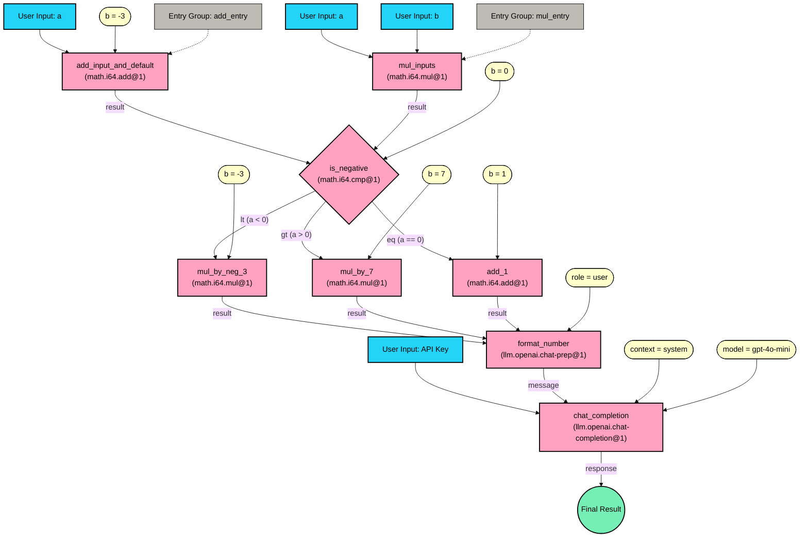

# Extending the Math Branching DAG with Chat Completion

This guide builds on the [Math Branching DAG with Entry Groups][math-branching-entry-guide] by adding a chat completion tool that explains the mathematical results. You'll learn how to:

1. Understand the need for a custom tool to bridge between math operations and chat completion
2. Add the chat completion tool to the DAG
3. Connect the math results to the chat completion tool
4. Configure the chat completion tool for optimal results

 Prerequisites
Follow the [setup guide](setup.md) to get properly setup in case you haven't.


## The Challenge: Type Safety Between Tools

Before you can connect our math operations to the chat completion tool, you need to understand a key challenge: type safety. The [LLM chat completion tool](../../tools/llm-openai-chat-completion/README.md)expects a `Message` struct as input, but the [math tool](../../tools/math/README.md) outputs numbers. You can't directly connect these without proper type conversion.

This is where you need a custom tool to bridge this gap. You'll use the `xyz.taluslabs.llm.openai.chat-prep@1` tool that you developed in the [Build the Missing Tool guide][llm-openai-chat-prep-tool]. This tool converts numbers into the proper message format that the chat completion tool expects.

## Step 1: Adding the Required Tools

First, let's add both the number-to-message tool and the chat completion tool to our DAG:

```json
{
  "vertices": [
    // ... existing math vertices ...
    {
      "kind": {
        "variant": "off_chain",
        "tool_fqn": "xyz.taluslabs.llm.openai.chat-completion@1"
      },
      "name": "chat_completion",
      "entry_ports": [
        {
          "name": "api_key",
          "encrypted": true
        }
      ]
    },
    {
      "kind": {
        "variant": "off_chain",
        "tool_fqn": "xyz.taluslabs.llm.openai.chat-prep@1"
      },
      "name": "format_number"
    }
  ]
}
```

## Step 2: Connecting the Math Results

You need to connect each of our final math operation results to the LLM chat prep tool:

```json
{
  "edges": [
    // ... existing math edges ...
    {
      "from": {
        "vertex": "mul_by_neg_3",
        "output_variant": "ok",
        "output_port": "result"
      },
      "to": {
        "vertex": "format_number",
        "input_port": "number"
      }
    },
    {
      "from": {
        "vertex": "mul_by_7",
        "output_variant": "ok",
        "output_port": "result"
      },
      "to": {
        "vertex": "format_number",
        "input_port": "number"
      }
    },
    {
      "from": {
        "vertex": "add_1",
        "output_variant": "ok",
        "output_port": "result"
      },
      "to": {
        "vertex": "format_number",
        "input_port": "number"
      }
    }
  ]
}
```

Remember that this works because only one of the output variants will be triggered at runtime.

## Step 3: Connecting to Chat Completion

Now you connect the formatted message to the chat completion tool:

```json
{
  "edges": [
    // ... existing edges ...
    {
      "from": {
        "vertex": "format_number",
        "output_variant": "ok",
        "output_port": "message"
      },
      "to": {
        "vertex": "chat_completion",
        "input_port": "prompt"
      }
    }
  ]
}
```

## Step 4: Configuring Default Values

You need to set up default values for both tools:

```json
{
  "default_values": [
    // ... existing math default values ...
    {
      "vertex": "format_number",
      "input_port": "role",
      "value": {
        "storage": "inline",
        "data": "user"
      }
    },
    {
      "vertex": "chat_completion",
      "input_port": "context",
      "value": {
        "storage": "inline",
        "data": {
          "role": "system",
          "value": "You are a sarcastic comedian that makes jokes about numbers. Make a joke about the following number:"
        }
      }
    },
    {
      "vertex": "chat_completion",
      "input_port": "model",
      "value": {
        "storage": "inline",
        "data": "gpt-4o-mini"
      }
    },
    {
      "vertex": "chat_completion",
      "input_port": "max_completion_tokens",
      "value": {
        "storage": "inline",
        "data": 512
      }
    },
    {
      "vertex": "chat_completion",
      "input_port": "temperature",
      "value": {
        "storage": "inline",
        "data": 1.0
      }
    }
  ]
}
```

## Step 5: Updating DAG outputs

We can no longer assign outputs to be on the math tools because they now have outgoing edges. Instead our new output will be the chat completion tool:

```json
{
  "outputs": [
    {
      "vertex": "chat_completion",
      "output_variant": "ok",
      "output_port": "completion"
    }
  ]
}
```

## Step 5: Updating Entry Groups

You need to add the `chat_completion` to our entry groups:

```json
{
  "entry_groups": [
    {
      "name": "add_entry",
      "vertices": ["add_input_and_default", "chat_completion"]
    },
    {
      "name": "mul_entry",
      "vertices": ["mul_inputs", "chat_completion"]
    }
  ]
}
```

## Complete DAG Structure

The complete DAG now looks like this:



</details>

## Putting it all together

Here's the complete DAG definition that combines all the components we've discussed:

<details>
<summary>Complete DAG Definition</summary>

```json
//math_branching_with_chat.json
{
  "vertices": [
    {
      "kind": {
        "variant": "off_chain",
        "tool_fqn": "xyz.taluslabs.math.i64.add@1"
      },
      "name": "add_input_and_default",
      "entry_ports": [
        {
          "name": "a"
          "encrypted": false
        }
      ]
    },
    {
      "kind": {
        "variant": "off_chain",
        "tool_fqn": "xyz.taluslabs.math.i64.mul@1"
      },
      "name": "mul_inputs",
      "entry_ports": [
        {
          "name": "a",
          "encrypted": false
        },
        {
          "name": "b",
          "encrypted": false
        }
      ]
    },
    {
      "kind": {
        "variant": "off_chain",
        "tool_fqn": "xyz.taluslabs.math.i64.cmp@1"
      },
      "name": "is_negative"
    },
    {
      "kind": {
        "variant": "off_chain",
        "tool_fqn": "xyz.taluslabs.math.i64.mul@1"
      },
      "name": "mul_by_neg_3"
    },
    {
      "kind": {
        "variant": "off_chain",
        "tool_fqn": "xyz.taluslabs.math.i64.mul@1"
      },
      "name": "mul_by_7"
    },
    {
      "kind": {
        "variant": "off_chain",
        "tool_fqn": "xyz.taluslabs.math.i64.add@1"
      },
      "name": "add_1"
    },
    {
      "kind": {
        "variant": "off_chain",
        "tool_fqn": "xyz.taluslabs.llm.openai.chat-completion@1"
      },
      "name": "chat_completion",
      "entry_ports": [
        {
          "name": "api_key",
          "encrypted": true
        }
      ]
    },
    {
      "kind": {
        "variant": "off_chain",
        "tool_fqn": "xyz.taluslabs.llm.openai.chat-prep@1"
      },
      "name": "format_number"
    }
  ],
  "edges": [
    {
      "from": {
        "vertex": "add_input_and_default",
        "output_variant": "ok",
        "output_port": "result"
      },
      "to": {
        "vertex": "is_negative",
        "input_port": "a"
      }
    },
    {
      "from": {
        "vertex": "mul_inputs",
        "output_variant": "ok",
        "output_port": "result"
      },
      "to": {
        "vertex": "is_negative",
        "input_port": "a"
      }
    },
    {
      "from": {
        "vertex": "is_negative",
        "output_variant": "lt",
        "output_port": "a"
      },
      "to": {
        "vertex": "mul_by_neg_3",
        "input_port": "a"
      }
    },
    {
      "from": {
        "vertex": "is_negative",
        "output_variant": "gt",
        "output_port": "a"
      },
      "to": {
        "vertex": "mul_by_7",
        "input_port": "a"
      }
    },
    {
      "from": {
        "vertex": "is_negative",
        "output_variant": "eq",
        "output_port": "a"
      },
      "to": {
        "vertex": "add_1",
        "input_port": "a"
      }
    },
    {
      "from": {
        "vertex": "mul_by_neg_3",
        "output_variant": "ok",
        "output_port": "result"
      },
      "to": {
        "vertex": "format_number",
        "input_port": "number"
      }
    },
    {
      "from": {
        "vertex": "mul_by_7",
        "output_variant": "ok",
        "output_port": "result"
      },
      "to": {
        "vertex": "format_number",
        "input_port": "number"
      }
    },
    {
      "from": {
        "vertex": "add_1",
        "output_variant": "ok",
        "output_port": "result"
      },
      "to": {
        "vertex": "format_number",
        "input_port": "number"
      }
    },
    {
      "from": {
        "vertex": "format_number",
        "output_variant": "ok",
        "output_port": "message"
      },
      "to": {
        "vertex": "chat_completion",
        "input_port": "prompt"
      }
    }
  ],
  "default_values": [
    {
      "vertex": "add_input_and_default",
      "input_port": "b",
      "value": {
        "storage": "inline",
        "data": -3
      }
    },
    {
      "vertex": "is_negative",
      "input_port": "b",
      "value": {
        "storage": "inline",
        "data": 0
      }
    },
    {
      "vertex": "mul_by_neg_3",
      "input_port": "b",
      "value": {
        "storage": "inline",
        "data": -3
      }
    },
    {
      "vertex": "mul_by_7",
      "input_port": "b",
      "value": {
        "storage": "inline",
        "data": 7
      }
    },
    {
      "vertex": "add_1",
      "input_port": "b",
      "value": {
        "storage": "inline",
        "data": 1
      }
    },
    {
      "vertex": "format_number",
      "input_port": "role",
      "value": {
        "storage": "inline",
        "data": "user"
      }
    },
    {
      "vertex": "chat_completion",
      "input_port": "context",
      "value": {
        "storage": "inline",
        "data": {
          "role": "system",
          "value": "You are a sarcastic comedian that makes jokes about numbers. Make a joke about the following number:"
        }
      }
    },
    {
      "vertex": "chat_completion",
      "input_port": "model",
      "value": {
        "storage": "inline",
        "data": "gpt-4o-mini"
      }
    },
    {
      "vertex": "chat_completion",
      "input_port": "max_completion_tokens",
      "value": {
        "storage": "inline",
        "data": 512
      }
    },
    {
      "vertex": "chat_completion",
      "input_port": "temperature",
      "value": {
        "storage": "inline",
        "data": 1.0
      }
    }
  ],
  "entry_groups": [
    {
      "name": "add_entry",
      "vertices": ["add_input_and_default", "chat_completion"]
    },
    {
      "name": "mul_entry",
      "vertices": ["mul_inputs", "chat_completion"]
    }
  ],
  "outputs": [
    {
      "vertex": "chat_completion",
      "output_variant": "ok",
      "output_port": "completion"
    }
  ]
}
```

</details>

## Publishing and Executing the DAG

### Publishing the DAG

Before you can execute the DAG, you need to publish it to the Nexus network. This can be done using the Nexus CLI:

```bash
# Publish the DAG definition
nexus dag publish --path sdk/src/dag/_dags/math_branching_with_chat.json
# Example output: DAG published successfully with Object ID: abc123...
```

After publishing, you'll receive a DAG ID hash that you'll need to use for all subsequent operations with this DAG. Make sure to store this ID securely as it's required for execution.

### 1.Testing

For testing, you can use the Nexus CLI to execute the DAG:

```bash
# Using the addition entry group
nexus dag execute --dag-id <dag_object_id> --entry-group add_entry --input-json '{
  "add_input_and_default": {"a": 10},
  "chat_completion": {"api_key": "your-api-key"}
}' --inspect chat_completion.api_key

# Using the multiplication entry group
nexus dag execute --dag-id <dag_object_id> --entry-group mul_entry --input-json '{
  "mul_inputs": {"a": 5, "b": 2},
  "chat_completion": {"api_key": "your-api-key"}
}' --inspect chat_completion.api_key
```

The `--inspect` flag will show you detailed information about the execution, including:

- The path taken through the DAG
- Inputs and outputs at each step
- Any errors that occurred
- The final chat completion response

The `api_key` entry port is defined as `encrypted` in the JSON structure, so the CLI will encrypt the data before sending it to the Nexus network.

### 2. Integration with Applications

To integrate this DAG into your application:

1. **Store the DAG**: First, store the DAG JSON definition in your application's workspace.

2. **Handle API Keys**: Securely manage the OpenAI API key. Consider using environment variables or a secrets management service.

3. **Create Entry Points**: Implement the two entry points in your application:

   - Addition path: Takes a single number and adds -3
   - Multiplication path: Takes two numbers and multiplies them

4. **Process Results**: Handle the chat completion response appropriately for your use case.

### 3. Error Handling

The DAG includes built-in error handling:

- **Math Operations**: If any math operation fails (e.g., overflow), the DAG will stop and return an error.
- **Chat Completion**: If the chat completion fails (e.g., invalid API key), the DAG will return an error.
- **Type Conversion**: The number-to-message conversion is handled safely by the `format_number` tool.

### 4. Monitoring and Debugging

To monitor and debug the DAG:

1. Use the `--inspect` flag with the CLI to see detailed execution information.
2. Check the execution logs for any errors or unexpected behavior.
3. Monitor the OpenAI API usage and costs through your OpenAI dashboard.

## Next Steps

1. Try different system prompts in the chat completion context to get different types of responses
2. Experiment with different temperature values to control the creativity of the responses
3. Consider adding more sophisticated formatting to the numbers before sending them to the chat completion tool

This extended DAG demonstrates how to combine mathematical computation with natural language processing, creating a more interactive and engaging experience for users.

## Key Points to Remember

1. **Type Safety**: Always ensure proper type conversion between tools. In this case, we needed a custom tool to convert numbers to messages.

2. **Entry Groups**: When adding new required inputs (like the API key), remember to update all entry groups.

3. **Default Values**: Set appropriate default values for the chat completion tool to ensure consistent behavior.

4. **Error Handling**: The DAG will handle errors gracefully at each step, whether from math operations, number formatting, or chat completion.

## Next Steps

1. Try different system prompts in the chat completion context to get different types of responses
2. Experiment with different temperature values to control the creativity of the responses
3. Consider adding more sophisticated formatting to the numbers before sending them to the chat completion tool

This extended DAG demonstrates how to combine mathematical computation with natural language processing, creating a more interactive and engaging experience for users.

<!-- List of references -->

[math-branching-entry-guide]: ./math-branching-dag-entry.md
[llm-openai-chat-prep-tool]: ./llm-openai-chat-prep-tool.md
